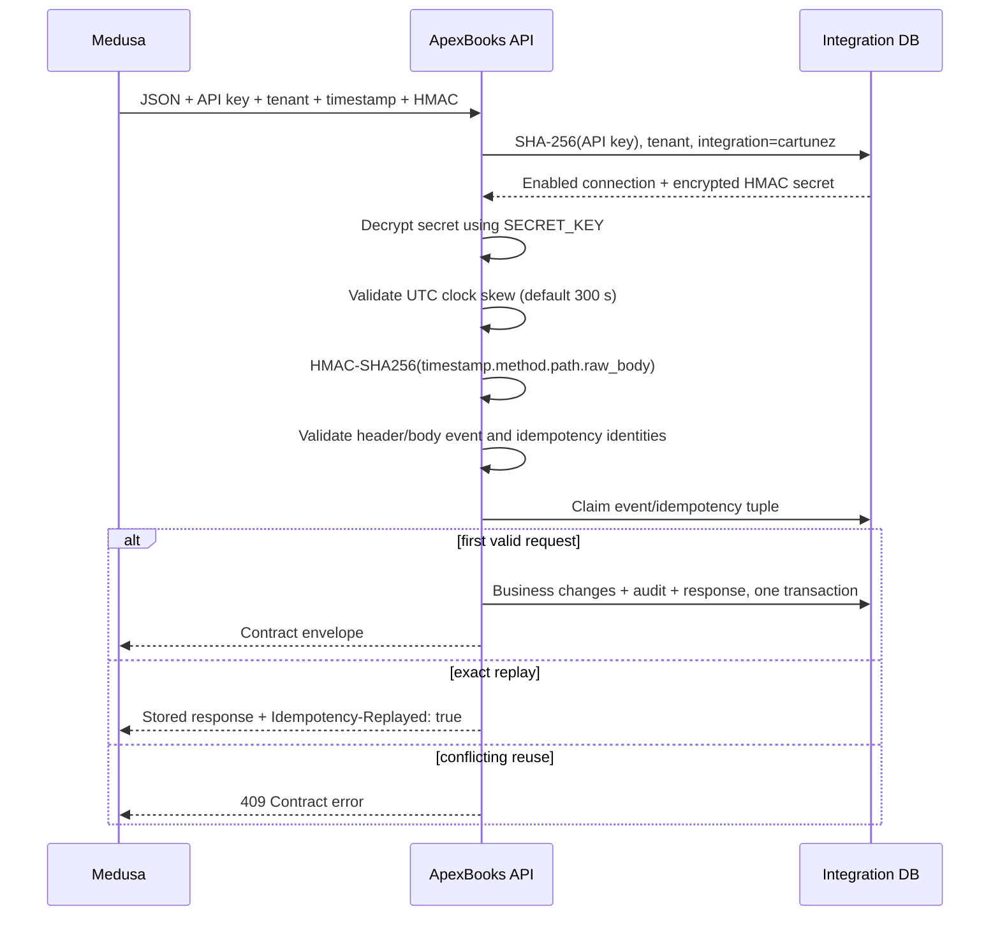

# Cartunez Medusa ↔ ApexBooks Deployment Bridge Verification

**Verification date:** 18 July 2026 (Asia/Calcutta)  
**Scope:** Read-only review of the ApexBooks repository and public ApexBooks deployment  
**Contract baseline:** ApexBooks Integration Contract v1, tag `integration-contract-v1`, commit `e31e965`  
**ApexBooks production URL:** `https://api.apexbooks.in`  
**Medusa production URL:** Not supplied

## Executive verdict

**Status: NOT READY / DEPLOYMENT BLOCKED.**

The public ApexBooks API and its health dependencies are reachable over HTTPS, but the production OpenAPI document exposes no `/api/integrations/*` paths and a request to the production order integration path returns `404 Not Found`. The local repository contains order and payment-capture receivers, but they are not present in the deployed API observed during this review.

The complete bridge is also blocked by three local gaps: there is no implemented inbound `customer.created` receiver, no outbound ApexBooks-to-Medusa master-data dispatcher, and no configured Medusa production base URL. Product, price, inventory, and ApexBooks-owned customer endpoints are Contract v1 **Medusa receiver** endpoints; registering receiver implementations inside ApexBooks does not deliver data to Medusa.

This review made no application, database, contract, or configuration changes. This report is the only created artifact.

## Integration architecture

```mermaid
flowchart LR
    M[Cartunez Medusa production\nURL not supplied]
    P[HTTPS / reverse proxy\napi.apexbooks.in]
    A[ApexBooks FastAPI]
    F[Integration foundation\nAPI key + HMAC + timestamp\ntenant + replay + idempotency]
    O[Order lifecycle]
    Y[Payment capture lifecycle]
    C[Canonical accounting models]
    D[(PostgreSQL\nintegration tables)]
    R[(Redis\nhealth / application services)]

    M -->|orders, payment captured, customer.created| P
    P --> A --> F
    F --> O --> C
    F --> Y --> C
    F --> D
    A --> R
    A -. required but missing:\ncustomer.created receiver .-> C
    A -. required but missing:\noutbound product/price/inventory/customer sender .-> M
```

### Directionality required by Contract v1

| Direction | Events/resources | Current local state | Production observation |
|---|---|---|---|
| Medusa → ApexBooks | order create/update/cancel | Implemented and registered locally | Routes absent from live OpenAPI; order path returns 404 |
| Medusa → ApexBooks | payment captured | Implemented and registered locally | Route absent from live OpenAPI |
| Medusa → ApexBooks | customer.created | Contract-defined, but no local receiver route found | Route absent |
| ApexBooks → Medusa | product, price, inventory, ApexBooks-owned customer PUTs | Receiver handlers exist locally in ApexBooks, but no outbound HTTP sender/dispatcher was found | Medusa URL unavailable; cannot verify receiver deployment |

## 1. API endpoints

All locally implemented receivers use the Contract v1 success/error envelopes and the shared integration processor. An exact replay returns the stored success response with HTTP `200` and `Idempotency-Replayed: true`; a conflicting event or idempotency reuse returns a Contract error, normally HTTP `409`.

### Medusa → ApexBooks receivers

Production base URL should be `https://api.apexbooks.in`.

| Purpose | Method and path | Local implementation | Success | Request validation |
|---|---|---|---|---|
| Order creation | `POST /api/integrations/medusa/v1/orders` | Present | `201`, Contract v1 envelope | Strict order-created schema; mapped active customer, products and variants; authoritative prices; GST; inventory references and availability |
| Order update | `PATCH /api/integrations/medusa/v1/orders/{external_order_id}` | Present | `200`, Contract v1 envelope | Strict update schema; path/body identity; revision and mutable-field rules; immutable financial changes rejected or routed to adjustment state |
| Order cancel | `POST /api/integrations/medusa/v1/orders/{external_order_id}/cancel` | Present | `200`, Contract v1 envelope | Strict cancel schema; mapped order; current state and accounting policy |
| Payment capture | `POST /api/integrations/medusa/v1/payments/captured` | Present | `201`, Contract v1 envelope | Strict payment-captured schema; mapped order; sequence, currency, cumulative amount and duplicate checks |
| Customer creation/sync | `POST /api/integrations/medusa/v1/customers` | **Missing** | Contract specifies Contract v1 envelope | Contract schema exists, but no registered ApexBooks route/service was found |
| Product sync into ApexBooks | None in Contract v1 | Not applicable | Not applicable | ApexBooks is the authoritative source for this master data |
| Inventory sync into ApexBooks | None in Contract v1 | Not applicable | Not applicable | ApexBooks is the authoritative source for this master data |

**Production result:** the live OpenAPI document contained zero `/api/integrations/*` paths. The live order integration URL returned `404`, not a method/authentication response. Therefore none of these local handlers can currently be considered deployed.

### ApexBooks → Medusa receiver contract

These URLs belong on the Medusa production host, not `api.apexbooks.in`.

| Purpose | Method and path | Expected success | Current bridge state |
|---|---|---|---|
| Product upsert | `PUT /api/integrations/apexbooks/v1/products/{apexbooks_product_id}` | `200` or `201`, Contract v1 envelope | Local ApexBooks receiver exists; no ApexBooks outbound caller found |
| Price replacement | `PUT /api/integrations/apexbooks/v1/prices/{apexbooks_product_id}` | `200` or `201`, Contract v1 envelope | Local receiver exists; no outbound caller found |
| Inventory replacement | `PUT /api/integrations/apexbooks/v1/inventory/{apexbooks_product_id}` | `200` or `201`, Contract v1 envelope | Local receiver exists; no outbound caller found |
| Customer upsert | `PUT /api/integrations/apexbooks/v1/customers/{apexbooks_customer_id}` | `200` or `201`, Contract v1 envelope | Local receiver exists; no outbound caller found |

The Medusa production URL was not supplied, so endpoint reachability, TLS, deployed schemas, and response behavior on the Medusa side could not be verified.

### Required request headers

Every integration request requires:

| Header | Requirement |
|---|---|
| `Content-Type` | `application/json` |
| `X-Api-Key` | Cleartext integration API key, 32–256 characters |
| `X-Tenant-Id` | External tenant identifier; must match the body and connection record |
| `X-Event-Id` | Event identifier; must match the body |
| `X-Idempotency-Key` | Contract idempotency key; must match the body |
| `X-Timestamp` | RFC 3339 UTC timestamp ending in `Z` |
| `X-Signature` | Lowercase `sha256=` followed by 64 hexadecimal characters |

No bearer `Authorization` header is used for this bridge.

### Response format

Success responses are shaped as:

```json
{
  "success": true,
  "data": {},
  "meta": {
    "request_id": "...",
    "event_id": "...",
    "tenant_id": "...",
    "version": "v1",
    "idempotency_key": "...",
    "processed_at": "..."
  }
}
```

Errors are shaped as:

```json
{
  "success": false,
  "error": {
    "code": "...",
    "message": "...",
    "details": {},
    "retryable": false
  },
  "meta": {
    "request_id": "...",
    "event_id": "...",
    "tenant_id": "...",
    "version": "v1"
  }
}
```

## 2. Authentication bridge

### Verified authentication flow



The signature input is exactly:

```text
{X-Timestamp}.{UPPERCASE_HTTP_METHOD}.{raw_request_path}.{raw_request_body_bytes}
```

The reverse proxy and Medusa sender must not normalize or reserialize the body after signing, and must preserve the raw path and all integration headers. Both systems require synchronized clocks.

### Credential storage and environment variables

ApexBooks does **not** read `APEXBOOKS_API_KEY`, `APEXBOOKS_WEBHOOK_SECRET`, or `APEXBOOKS_TENANT_ID` from its environment. Per-tenant credentials are stored in `integration_connections`:

- `api_key_hash`: SHA-256 hash used for authentication
- `api_key_prefix`: display/lookup aid
- `hmac_secret_encrypted`: encrypted webhook secret
- `external_tenant_id`: Medusa-facing tenant identifier
- `status`, `clock_skew_seconds`, and `replay_retention_days`: connection controls

The ApexBooks deployment needs these existing application settings:

```dotenv
APP_ENV=production
DATABASE_URL=
REDIS_URL=
SECRET_KEY=                 # must remain stable; decrypts integration secrets
JWT_SECRET_KEY=
ALLOWED_ORIGINS=
SENTRY_DSN=                 # optional in code, recommended for production monitoring
```

The Medusa deployment needs equivalent sender configuration. These names are a deployment convention, not settings implemented in this ApexBooks repository:

```dotenv
APEXBOOKS_API_BASE_URL=https://api.apexbooks.in
APEXBOOKS_API_KEY=
APEXBOOKS_WEBHOOK_SECRET=
APEXBOOKS_TENANT_ID=
```

For outbound master synchronization, ApexBooks also needs a Medusa base URL and sender credentials. No supported `MEDUSA_API_URL` or equivalent setting was found.

The workspace `.env` was inspected by key presence only. It is a development configuration (`APP_ENV=development`), has localhost-only CORS origins, and has no `SENTRY_DSN`, Medusa URL, or bridge-named credential variables. This does not establish the production secret state.

## 3. Tenant mapping

The tenant is resolved as follows:

```text
X-Tenant-Id / body tenant_id
    → integration_connections.external_tenant_id
      where integration_name = "cartunez"
      and api_key_hash matches SHA-256(X-Api-Key)
    → integration_connections.tenant_id
    → tenants.id (UUID)
```

Contract-facing tenant IDs use `^[a-z][a-z0-9_]{2,63}$`; an example is `tenant_cartunez_in`. The generic foundation accepts a slightly broader identifier, but the strict Contract v1 request schemas enforce the contract format.

Configuration is stored in PostgreSQL in `integration_connections`, not in a static tenant environment variable. The connection and tenant must both be enabled.

Failure behavior:

| Condition | Expected response |
|---|---|
| Missing tenant header or unresolved tenant for a known connection | `403 TENANT_NOT_RESOLVED` |
| Invalid/unknown API key | `401 AUTH_FAILED` |
| Disabled connection or tenant | `403 TENANT_DISABLED` |
| Header/body tenant mismatch | Contract validation error |

No production connection row or tenant provisioning could be verified from the public API.

## 4. Database mapping

### Core integration tables

| Table | Important fields | Purpose |
|---|---|---|
| `integration_connections` | `tenant_id`, `integration_name`, `external_tenant_id`, `api_key_hash`, `hmac_secret_encrypted`, `status` | Tenant and credential bridge |
| `integration_entity_map` | `tenant_id`, `integration_name`, `entity_type`, `external_id`, `internal_id`, `external_version`, `sync_status`, `last_synced_at` | Generic external ↔ internal mapping |
| `integration_event_log` | `request_id`, `tenant_id`, `event_id`, `idempotency_key`, `event_name`, request/response hashes, status, timing, error | Durable request and audit history |
| `integration_replay_cache` | `event_id`, `idempotency_key`, request/response hashes, encrypted response, status, expiry | Replay and duplicate-event protection |

### Business mappings

| Bridge | Actual local tables and fields |
|---|---|
| Medusa order ↔ ApexBooks sales order | `integration_order_state.medusa_order_id`, `sales_order_id`, `apexbooks_order_id`, plus an `integration_entity_map` row with `entity_type='order'`, Medusa ID as `external_id`, and `sales_orders.id` as `internal_id` |
| Medusa customer ↔ ApexBooks customer | `integration_synced_customers.medusa_customer_id`, `apexbooks_customer_id`; generic entity-map records exist for master synchronization. The inbound canonical-customer receiver is missing |
| Medusa product/variant ↔ ApexBooks item | `integration_synced_products.medusa_product_id`, `apexbooks_product_id`; `integration_synced_product_variants.medusa_variant_id`, `apexbooks_variant_id`, `sku`; generic entity-map rows prevent duplicate mappings |
| Medusa payment ↔ ApexBooks payment/receipt | `integration_payment_state.medusa_payment_id`, `payment_id`, `apexbooks_payment_id`, `receipt_id`, amount/currency/provider/transaction/status; generic payment mapping points to `payments.id` |
| Invoice lines | `integration_invoice_line_map` links integration/order lines to invoice lines |
| Inventory accounting references | `integration_inventory_movement` and `integration_payment_inventory_movement` track reservations and sale movements |
| Lifecycle audit | `integration_master_sync_audit`, `integration_order_audit`, `integration_payment_audit`, plus `integration_event_log` |

The local migration chain contains:

- `20260717_0002_add_integration_foundation.py`
- `20260718_0003_add_master_data_sync.py`
- `20260718_0004_add_order_lifecycle.py`
- `20260718_0005_add_payment_capture.py`

The application health code still hard-codes required revision `20260717_0002`, while the local migration head is `20260718_0005`. Deploying the later integration migrations without updating that expectation would make the current health check report the newer database as outdated. The live health endpoint reports schema OK while the live OpenAPI lacks integration paths, which is consistent with an older deployed application; public access cannot prove the production database revision.

## 5. Business-flow verification

### Customer

```text
Medusa Customer
    → POST customer.created to ApexBooks
    → resolve tenant and duplicate event
    → ApexBooks Customer
```

**Missing connection:** the Contract v1 inbound customer route is not implemented locally. The existing customer PUT is the opposite direction—ApexBooks-owned fields sent to a Medusa receiver.

### Order

```text
Medusa Order
    → mapped customer/product/variant/price/inventory validation
    → ApexBooks draft Sales Order + lines
    → inventory reservation + accounting reference
    → order/entity mappings and audit
```

The local order implementation follows this flow and does not create a receipt or credit note at order creation. It is not deployed on the observed production API.

### Payment

```text
Medusa Payment Capture
    → resolve existing order and validate cumulative capture
    → create/post Invoice on first capture
    → create Payment + allocation/receipt reference
    → invoice and receipt journal entries
    → convert reservations to SALE_OUT inventory movements
    → payment/entity mappings and audit
```

The requested target flow, “Invoice + Receipt + Ledger,” is present in the local capture implementation. Refund and credit-note processing are intentionally outside this implementation. The production route is absent.

### Inventory/master data

```text
ApexBooks Product / Price / Inventory / ERP-owned Customer
    → signed Contract v1 PUT
    → Medusa receiver
```

**Missing connection:** no outbound HTTP client, delivery worker, or configured Medusa production target was found. A webhook queue model exists, but no active enqueue-and-dispatch workflow was found for these master-data events. Consequently, the current local PUT receiver registrations do not complete the production bridge.

## 6. Production-readiness checks

Public checks were non-mutating and performed against `https://api.apexbooks.in`.

| Check | Result | Assessment |
|---|---|---|
| External API reachability | `GET /` returned `200` JSON | Pass |
| Health | `GET /health` returned `200`, with database, schema, and Redis marked OK | Pass for the deployed base application |
| HTTPS | Valid HTTPS response through nginx; HSTS present | Pass |
| Published API surface | `/openapi.json` returned `200`, but exposed zero integration paths | **Blocker** |
| Order bridge path | `/api/integrations/medusa/v1/orders` returned `404` | **Blocker** |
| Medusa reachability | Production URL not supplied | **Not verifiable / blocker** |
| CORS | Configurable allow-list; workspace config is localhost-only | Server-to-server webhooks do not require CORS. Add Medusa origin only if a browser calls ApexBooks directly, which is not recommended |
| Webhook ingress | No application IP allow-list requirement found | Proxy/firewall must permit Medusa POST/PATCH traffic and preserve headers, path, and raw body |
| Rate limiting | Global SlowAPI setup/default exists; no explicit per-integration route limit was found | Reverse-proxy limits are unknown; define and monitor an integration-specific policy before launch |
| Errors | Contract v1 envelopes implemented locally, including retryable flags | Not verifiable on production integration paths because they return 404 |
| Logging/audit | Request IDs, application logs, event log, lifecycle audit tables, hashes and processing time are implemented locally | Production ingestion/retention and alerting are not demonstrated |
| Retry handling | Inbound retries are safe through event/idempotency claims and stored replay responses | No working outbound master-data retry dispatcher was found |
| Monitoring | `/health` checks database/schema/Redis; Sentry is conditional on `SENTRY_DSN` | No Prometheus/OpenTelemetry metrics or integration-specific alerts were found; local Sentry variable is absent |
| Clock synchronization | Timestamp window defaults to 300 seconds | Both production hosts require reliable NTP |

## Missing configuration

1. Medusa production API base URL.
2. Confirmed production `integration_connections` row for Cartunez, including enabled tenant, API-key hash, encrypted HMAC secret, clock skew, and retention.
3. The matching cleartext API key, HMAC secret, and external tenant ID in Medusa secret storage.
4. A supported ApexBooks outbound Medusa URL/credential configuration.
5. Production monitoring destinations, log retention, dashboards, and alerts for failed/replayed integration events.
6. A documented reverse-proxy/firewall policy that preserves signed request bytes and integration headers.

## Deployment blockers

| Priority | Blocker | Evidence / impact |
|---|---|---|
| P0 | Integration routers are not deployed at `api.apexbooks.in` | Live OpenAPI has no integration paths; live order path returns 404 |
| P0 | No Medusa production URL was provided | Medusa receiver reachability and TLS cannot be verified |
| P0 | Inbound Medusa customer sync is missing locally | Order creation cannot rely on a complete Medusa-customer provisioning flow |
| P0 | No outbound ApexBooks → Medusa master-data dispatcher | Product, price, inventory, and ERP-owned customer updates cannot reach Medusa |
| P0 | Master-data receiver direction is misplaced in the ApexBooks app | Local receiver routes do not substitute for Medusa-hosted Contract v1 receivers |
| P1 | Schema health expectation is pinned to foundation revision `20260717_0002`, behind local head `20260718_0005` | Deploying all integration migrations can make the current health gate report a mismatch |
| P1 | Production tenant/credential provisioning is unverified | Authentication, HMAC, and tenant resolution cannot be proven end-to-end |
| P1 | Outbound retry/dead-letter execution is not wired | Master-data delivery cannot be made reliable |
| P1 | Integration-specific telemetry and alerting are incomplete/unverified | Failures, latency, replay spikes, and queue backlog may go unnoticed |

## Required non-mutating go-live re-verification

After the blockers are addressed by the deployment owners, repeat the following without creating business records:

1. Confirm the live OpenAPI exposes all intended ApexBooks receiver routes.
2. Confirm unauthenticated calls reach integration middleware and return Contract envelopes rather than 404/HTML/proxy errors.
3. Confirm the production database is on the intended Alembic head and `/health` accepts that head.
4. Verify the enabled `integration_connections` metadata without revealing secrets.
5. Resolve and check the Medusa production host, TLS chain, receiver paths, and non-mutating authentication failures.
6. Run a separately authorized synthetic-event test with disposable tenant data to prove HMAC, tenant mapping, replay, idempotency, transactions, audit logging, and outbound delivery. That test is outside this read-only review.

## Final assessment

ApexBooks' local integration foundation provides the required authentication, tenant isolation, replay protection, idempotency, transactional processing, and auditing mechanisms. The local order and payment-capture business flows are substantially connected to accounting and inventory records. However, the production API does not expose those routes, customer ingress is incomplete, and the ApexBooks-to-Medusa master-data delivery leg is absent. The Cartunez Medusa ↔ ApexBooks bridge is therefore **not production ready** at the time of verification.
